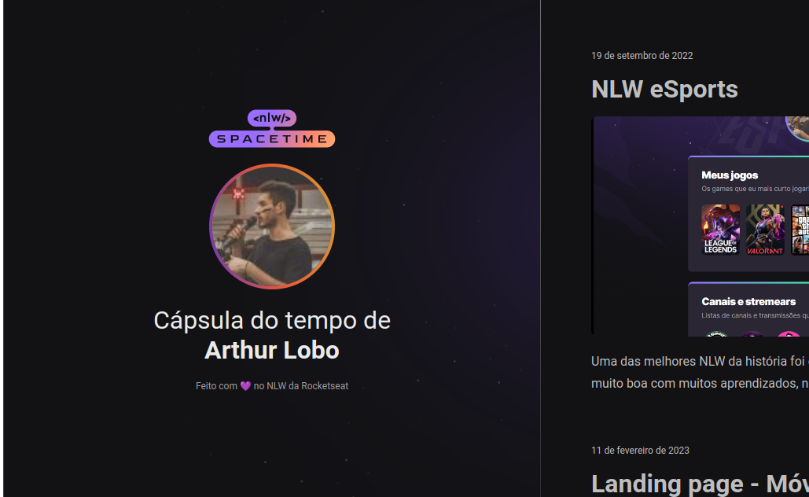

<h1 align="center">
  ⌛ Cápsula do tempo ⌛
</h1>

   

## 🖥️ Projeto
O projeto é uma cápsula do tempo, que exibe memórias em uma timeline.

## 🚀 Tecnologias 
Esse projeto foi desenvolvido durante a NLW da Rocketseat com as seguintes tecnologias:

- HTML 
- CSS
- Git e Github
- Figma

## 🏷️ Layout
Layout disponível através [deste link](https://www.figma.com/file/ZFrZLT10FfoUvSc5xeya5J/C%C3%A1psula-do-tempo-%E2%80%A2-Trilha-Explorer-(Community)-(Copy)?type=design&node-id=306-3&t=39w8hf0FIKjYRKhP-0)